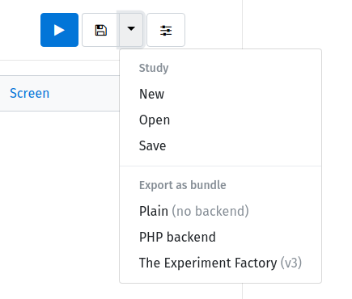
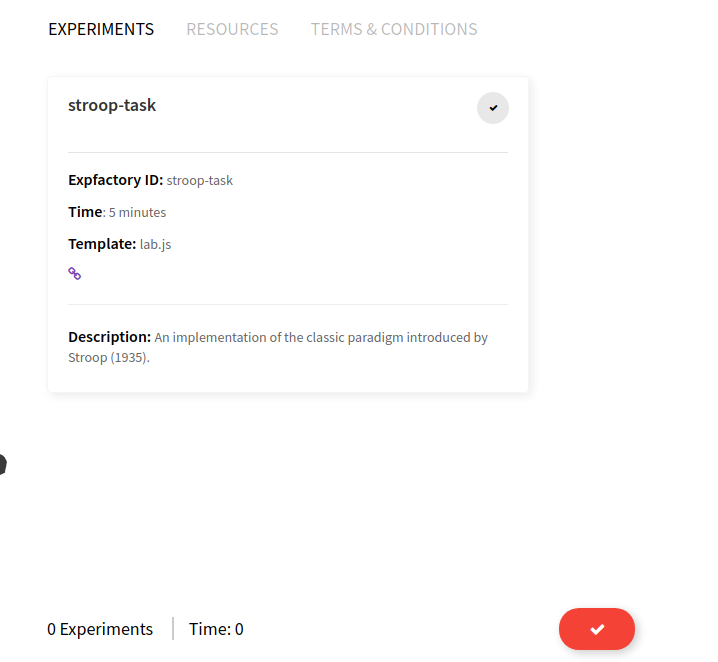

# Experiment Factory :heart: LabJS

If you want to make your own experiment interactively, [LabJS](https://github.com/getify/LABjs) can help you!


## Quick Resources

 - [Documentation](https://expfactory.github.io/expfactory/integration-labjs) on expfactory.github.io
 - [Expfactory Builder](https://expfactory.github.io/builder) is the general builder (for different kinds of experiments, LabJS included)
 - [Development Writeup](https://vsoch.github.io/2018/debugging-labjs) details the development of the LabJS expfactory integration

And below you can find a concise version of the documentation, for keeping with the codebase.

## Design Your Experiment
Take a look at the [getting started](https://github.com/FelixHenninger/lab.js) section of the README.md file linked in the main repository. There is ample documentation about a started kit, along with a tutorial to build your first experiment. You will use the [LabJS builder interface](https://labjs.felixhenninger.com/) to design your experiment, and when you finish, the Experiment Factory (v3.0) is an export option:



This will export a zip file of all the files needed to plug into the Experiment Factory! To help you learn and get started, we are providing an example export of a Stroop task in this folder. We will walk through the basic steps to get this experiment running in your experiment container.

## 1. Export and Extract
Let's first extract the exported experiment. It will dump the required files into a folder in the present working directory.

```
unzip stroop-task-export.zip
ls
stroop-task
```
Take a look at the `config.json` in the folder. It will provide metadata exported about your experiment, and you can customize this if needed before building your container.

```
cat stroop-task/config.json 
{
  "name": "Stroop task",
  "exp_id": "stroop-task",
  "url": "https://github.com/felixhenninger/lab.js/examples/",
  "description": "An implementation of the classic paradigm introduced by Stroop (1935).",
  "contributors": [
    "Felix Henninger <mailbox@felixhenninger.com> (http://felixhenninger.com)"
  ],
  "template": "lab.js",
  "instructions": "",
  "time": 5
}
```

If at this point you want to contribute your experiment to the experiment's library, we highly encourage this so others can use it too! It comes down to adding it to a Github repository, and submitting a pull request. Read [instructions here](https://expfactory.github.io/expfactory/contribute#the-experiment-repository).


## 2. Build
We now will recruit the builder to turn our folder into a reproducible experiment container!

```
docker run -v $PWD:/data vanessa/expfactory-builder build /data/stroop-task
```

Yes, it's going to give you a warning that you are building without a repository.

```
WARNING 1 local installs detected: build is not reproducible without experiment folders
Expfactory Version: 3.1
local experiment /data/stroop-task found, validating...
LOG Recipe written to /data/Dockerfile
```

You will notice a Dockerfile in the present working directory, and it's there because we mapped the `/data` folder in the container to it. It will also give you the command to build your image! You can change the container name to be whatever you like. Let's call it `vanessa/stroop`:

```
To build, cd to directory with Dockerfile and:
              docker build --no-cache -t expfactory/experiments .

$ docker build --no-cache -t vanessa/stroop .
```

## 3. Run
And that's it! You can now start and run your container, and [there are many ways to do that](https://expfactory.github.io/expfactory/usage). Here is a simple headless start:

```
docker run -d -p 80:80 vanessa/stroop start
```

and you will see the familiar interface to choose your task and get started. Have fun!



**Note** that we are fixing a bug with submission of the data, and it will be resolved soon.
